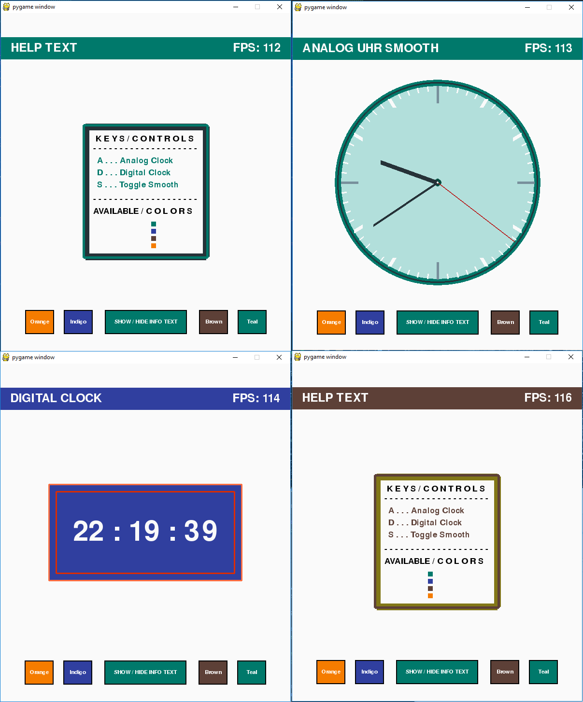

.. Pygame Clock documentation master file, created by
   sphinx-quickstart on Sat Nov 12 21:35:26 2016.
   You can adapt this file completely to your liking, but it should at least
   contain the root `toctree` directive.

Welcome to Pygame Clock's documentation!
========================================

Bibliographic feild:
--------------------
   :Author: Philipp Kogler
   :organization: TGM Wien
   :date: 2016-12-11
   :revision: 1.0.1
   :version: 1.0

Contents:
---------

.. toctree::
   :maxdepth: 2

   control
   view
   button

Usage:
------
*Controller*

>>> from kogler.clock_controller import Controller
>>> from datetime import datetime
>>> c = Controller((600,700), View.CLR_SCHEMA_BROWN, datetime.now().time(), 1)

*View*

>>> from kogler.clock_view import View
>>> import pygame as pg
>>> v = View(View.CLR_SCHEMA_BROWN, pg.screen, (600.700))
>>> # Update View
>>> v.update_view(pg.time.Clock())
>>> # draw Analog Clock
>>> v.show_analog_clock(True)

View:
=====

Indices and tables
==================

* :ref:`genindex`
* :ref:`modindex`
* :ref:`search`

